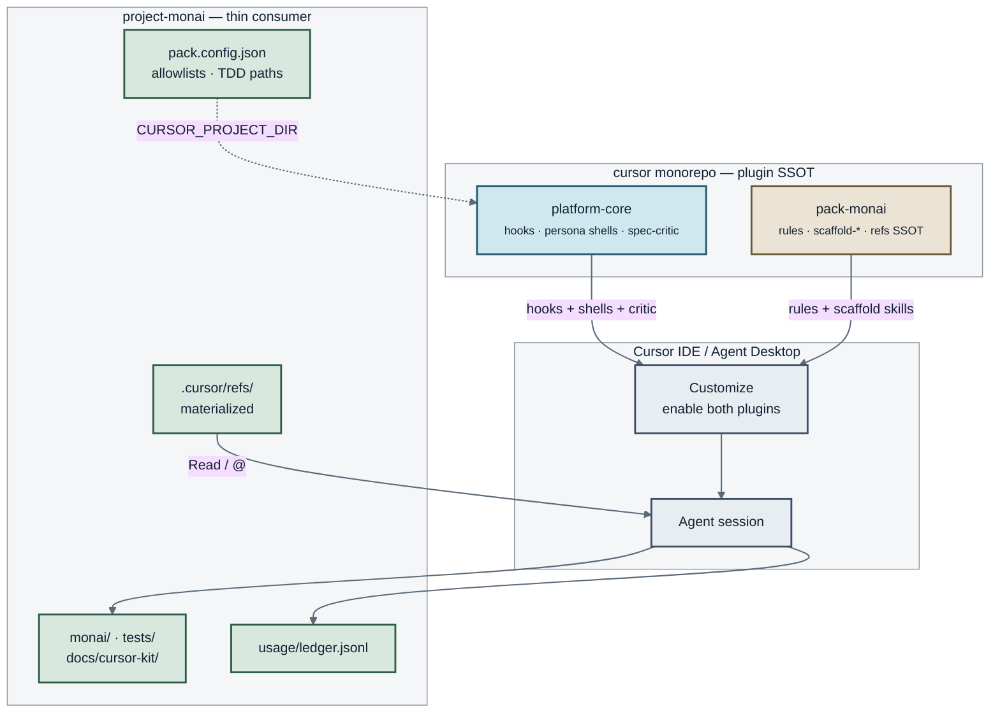
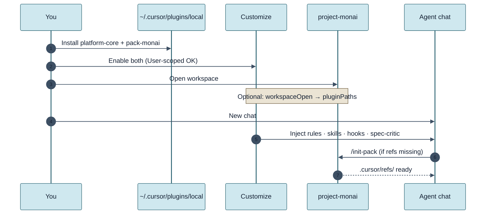
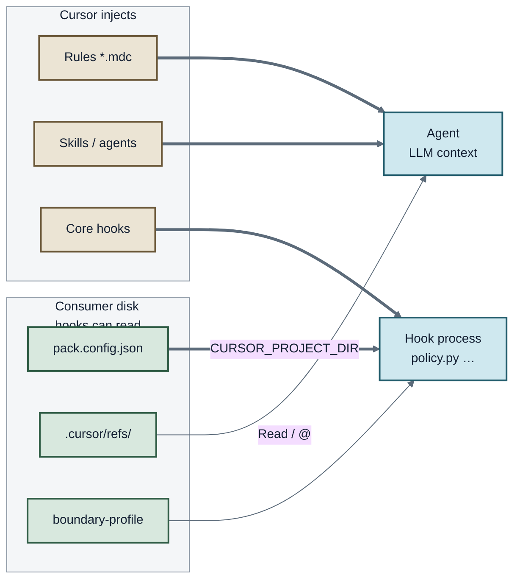
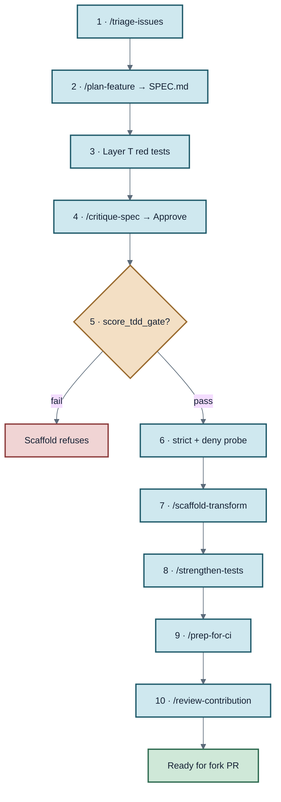
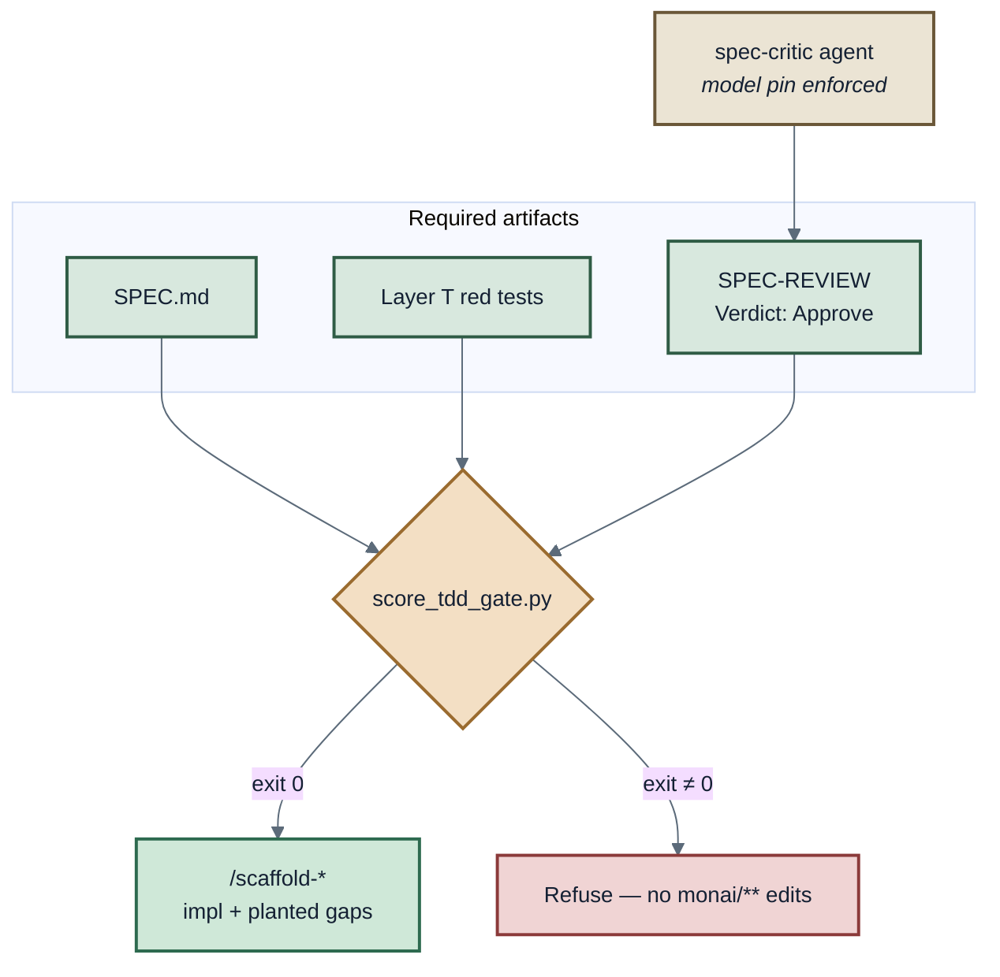
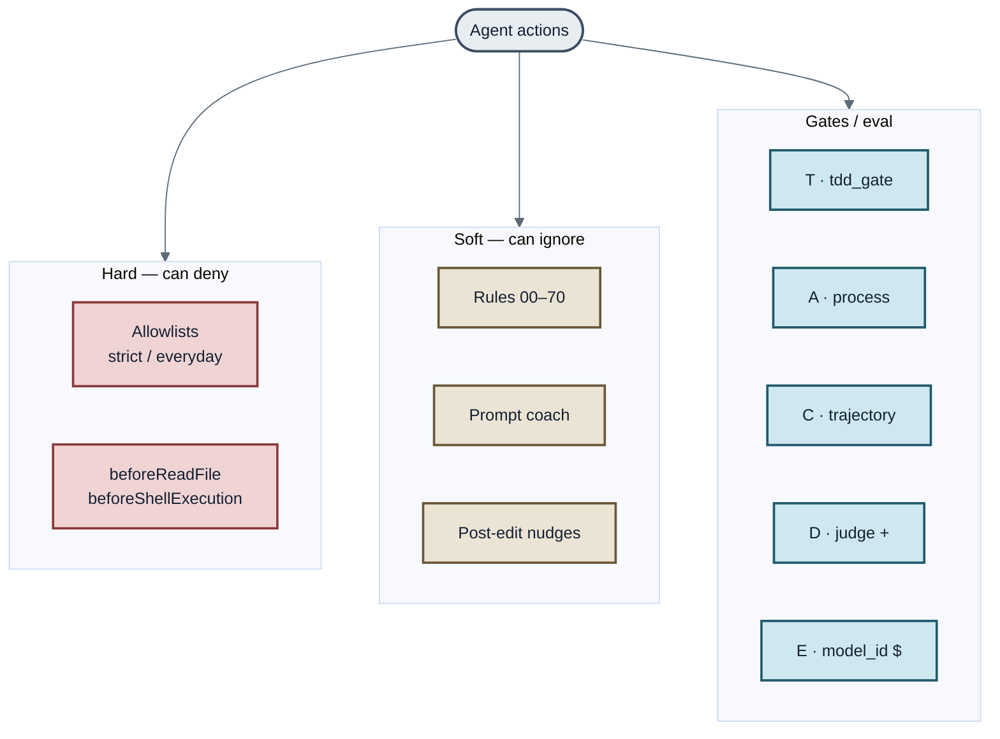

# Architecture — Cursor kit + project-monai

Panel-facing diagrams for **how the setup is wired**: monorepo plugins, thin
consumer, load path, contribution spine, and enforcement layers.

**Spoken frame:** *platform-core is the portable factory floor; pack-monai is the
MONAI jig; project-monai is the job on the bench.*

**View tip:** Cursor / GitHub render Mermaid live. For slides, paste a diagram into
[Mermaid Live Editor](https://mermaid.live) → Export PNG/SVG (theme already set
below for print contrast).

Related: [`DEMO.md`](DEMO.md) · [`productization/PRODUCTIZATION.md`](productization/PRODUCTIZATION.md)
· [`EVALUATION.md`](EVALUATION.md) · sibling [`cursor/README.md`](../../../cursor/README.md)

---

## Legend (all diagrams)

| Color | Role |
|---|---|
| Teal | **platform-core** (portable engine) |
| Sand | **pack-monai** (library content) |
| Sage | **project-monai** consumer / workspace |
| Amber | Gate / decision |
| Rose | Refuse / deny |
| Green | Pass / approve path |

---

## 1. High level — three pieces



| Piece | Owns | Does not own |
|---|---|---|
| **platform-core** | Boundary/ledger/nudge engine, persona skill shells, `spec-critic`, score/judge runners | MONAI paths, rule text |
| **pack-monai** | Rules `00–70`, `/scaffold-*`, refs **SSOT**, pack.config schema + example | Hook engine |
| **project-monai** | Library code, DEMO/EVAL, `pack.config` **instance**, materialized refs, ledger | Duplicate rules/skills as SSOT |

---

## 2. Plugin load path (what you enable)



**v1 reality:** manual Customize enable is the reliable path. `workspaceOpen → pluginPaths` is a bonus after reload.

**Talk track:** *Plugins are User-scoped in the spike; the agent session on project-monai still receives pack rules when both plugins are on.*

---

## 3. Split-by-reader (why config is not “in the pack plugin”)

Cursor has **no** cross-plugin filesystem for hooks. Readers differ:



| Content | How it reaches the agent / hooks |
|---|---|
| Rules + skills | Cursor **injects** |
| Refs | Pack SSOT → `/init-pack` → `.cursor/refs/` → agent reads |
| Allowlists, coach, nudge, TDD paths | `pack.config.json` → hooks via `CURSOR_PROJECT_DIR` |

---

## 4. Contribution spine (workflow)

Seven `/` skills on the live path (plus Layer T tests between plan and critique):



**Topology (say once):** each persona owns a stage; handoff is **artifacts** — not a god-command. Subagents stay **intra-stage**. Follow-on: [ADR-0001 thin orchestrator](../../../cursor/docs/superpowers/specs/2026-07-21-thin-orchestrator-adr.md).

---

## 5. Low level — Layer T hard gate



Only **enforceable** model pin in v1: `spec-critic` (`cursor-grok-4.5-high-fast`). Skills do not honor `model:`.

---

## 6. Low level — guardrails stack



Hooks ≠ OS sandbox. Strict = contribution boundary; everyday = org boundary.

---

## 7. Where files live (cheat sheet)

```text
cursor/
  plugins/platform-core/   hooks, persona skills, spec-critic, score_trajectory, llm_judge
  plugins/pack-monai/      rules, scaffold-*, refs SSOT, pack.config schema/example
project-monai/
  .cursor/pack.config.json boundary-profile refs/ usage/
  docs/cursor-kit/         DEMO EVAL ARCHITECTURE scripts/
  monai/ tests/            library under contribution
```

Consumer `docs/cursor-kit/scripts/*` are mostly **thin wrappers** → `platform-core` (or pack scripts for deprecations/changelog).
