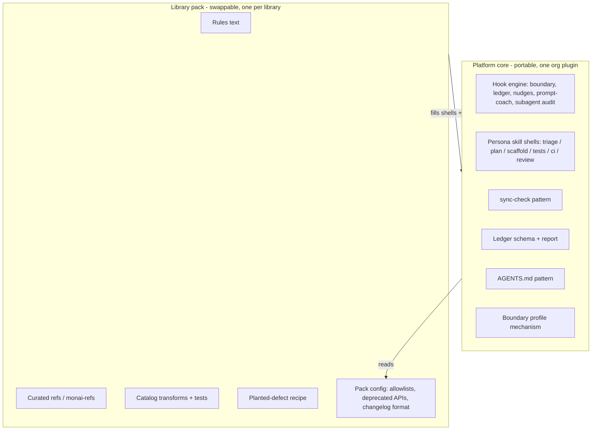

# Productization (skeleton)

**Status:** skeleton only. Nothing here is published, loaded, or changes runtime behavior. The live demo runs entirely off the in-repo kit (`.cursor/`, `docs/cursor-kit/`). This document + [`manifest.json`](manifest.json) record *how* the kit would split into a portable platform and per-library packs, so extraction is a lift-and-shift rather than a rewrite.

## Why a skeleton, not a plugin (yet)

Publishing this fork's folder as a Marketplace/org plugin as-is would be wrong: the content pack is MONAI/transforms-specific. The value that generalizes is the **platform core** (persona SDLC rails), not the MONAI text. So v1 keeps the pack in-repo for a reliable demo and captures the split here. This is a deliberate scope decision, not an omission.

## Core vs pack

| Layer | Portable? | Contents | Extraction move |
|---|---|---|---|
| Platform core | Yes | Hook engine, persona skill *shells*, sync-check *pattern*, ledger schema + report, AGENTS pattern, boundary mechanism | Ship verbatim to an org/private plugin |
| Library pack | No | Rules text, `monai-refs/`, catalog transforms + tests, planted-defect recipe, and pack **config** (path allowlists, deprecated-API patterns, changelog format) | Swap this folder per target library |

The one seam to fix during extraction: today a few library specifics live *inside* core scripts (allowlists in `policy.py`, anti-pattern strings in `prompt_coach.py`, checked-file list in `sync-check.sh`). Extraction hoists those into pack-provided config injected at load. See `not_in_v1` in [`manifest.json`](manifest.json).

## Extraction plan (later, not mid-panel)

1. Move `core` components (see manifest) into an org/private Cursor plugin unchanged.
2. Replace inlined library constants with a `pack.config` contract (allowlists, deprecation rules, changelog format, checked-file manifest).
3. Keep `pack` folders per library (`monai-intensity-transforms`, then the next target); the plugin loads one pack at a time.
4. Version core and packs independently; `sync-check` + CODEOWNERS + kit CI move with core, guard lists move with pack.

## Agents / subagents (next, out of scope for v1)

The same persona prompts can be registered as **standing agents** so the default agent delegates QA/review automatically; the `/`-invoked skills stay for explicit demo control. The `subagentStart`/`subagentStop` audit hook already logs delegation to the ledger, so the observability half is in place. Not built in v1 on purpose — it would add demo variance for no grading benefit.

## What this is *not*

- Not a published plugin, not wired into Cursor, not on any load path.
- No new runtime behavior: removing this folder changes nothing about the demo.
- Not a LOC exercise. The KPI is ramp time and convention adherence, not lines shipped.

**Source of truth:** [`manifest.json`](manifest.json), and the "Beyond demo" section of [`../DEMO.md`](../DEMO.md).
