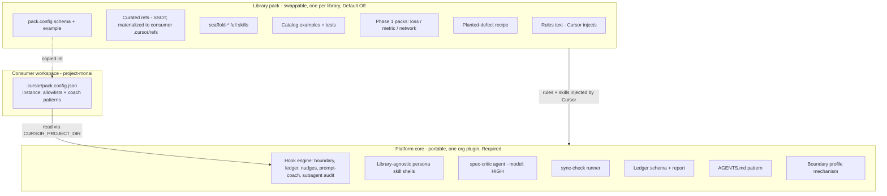

# Productization (Phase 4 layout)

**Status:** Phase 4 — layout + thin consumer + refs materialization. Runtime kit content lives in the sibling `cursor` monorepo plugins (`platform-core`, `pack-monai`); this consumer keeps `.cursor/pack.config.json` + `boundary-profile` + materialized `.cursor/refs/` + `usage/`, plus DEMO/EVAL narrative under `docs/cursor-kit/`. See [`manifest.json`](manifest.json) for the seam contract.

## Why plugins + thin consumer

The content pack is MONAI-specific (intensity transforms plus Phase 1 loss/metric/network packs). The value that generalizes is the **platform core** (persona SDLC rails). Phase 4 physically moves rules/skills/hooks/agents into plugins and materializes refs into the consumer — refs stay deep and on-demand (not distilled into rules).

## Core vs pack

| Layer | Portable? | Contents | Extraction move |
|---|---|---|---|
| Platform core | Yes | Hook **engine**, library-agnostic skill *shells*, **spec-critic agent**, sync-check *runner*, ledger schema + report, AGENTS pattern, boundary mechanism | Ship verbatim to an org/private plugin (Required) |
| Library pack | No | Rules text, `refs/` (SSOT → materialized to consumer `.cursor/refs/`), `scaffold-*` skills, catalog examples + tests (transforms + Phase 1 loss/metric/network), planted-defect recipe, and the pack.config **schema + example** | Swap this folder per target library (Default Off) |
| Consumer | n/a | The `.cursor/pack.config.json` **instance** (allowlists, coach patterns, nudge globs) — workspace policy, same class as `boundary-profile` | Commit one per library repo from the pack's example |

**The one seam to fix — split by reader** (Cursor has no cross-plugin path resolution, so a core hook cannot read a file inside the pack plugin):

- **Agent-facing content** — pack **rules** + `scaffold-*` skills: **Cursor injects** these. Core skill shells stay library-agnostic and get specifics from these injected rules — not a spliced body.
- **`refs/`** is **not** injected (Cursor injects rules/skills/agents/hooks, not a `refs/` tree). Authoring SSOT in `plugins/pack-monai/refs/`, **materialized into the consumer's `.cursor/refs/`** (by `/init-pack`, like `pack.config.json`); rules cite the workspace path and the agent reads on demand. Keeps rules concise + always-on, refs deep + on-demand. Don't inline refs into rules, don't leave them as consumer SSOT, don't point at `@pack-monai/refs/…`.
- **Hook-facing config** (today inlined in `policy.py` allowlists, `prompt_coach.py` anti-patterns, `sync-check.sh` file list): moves to the consumer's `.cursor/pack.config.json`, read at `$CURSOR_PROJECT_DIR/.cursor/pack.config.json`. The pack owns the schema + example; the consumer commits the instance.

See the `seam` block in [`manifest.json`](manifest.json) for the authoritative contract.

## Extraction plan (spike-gated; see the design spec for the full phasing)

1. Ship **Layer T + the spec-critic agent** first, on the kit branch — no plugin work.
2. **Spike the seam** (go/no-go): prove `workspaceOpen` pack-load + hooks reading `.cursor/pack.config.json` via `CURSOR_PROJECT_DIR` + strict deny-with-diagnostic + **zero MONAI literals in core**.
3. Move `core` components into an org/private Cursor plugin (**Required**); replace inlined library constants with reads from the consumer's `.cursor/pack.config.json` (pack ships the schema + example).
4. Keep `pack` folders per library (`pack-monai` with transform + Phase 1 archetype packs, then e.g. `pack-diffuser`), each **Default Off**. Cursor injects each enabled pack's rules/skills; `workspaceOpen` (post-spike) auto-loads the right pack from the consumer's `pack` field.
5. Version core and packs independently; `sync-check` runner + CODEOWNERS + kit CI move with core, guard lists move to the consumer instance. **CI note:** GitHub runners have no Cursor plugin installer — fetch the moved scripts via submodule / pinned checkout / package.

Adding a second library touches **zero** core code: new `pack-<lib>` folder + one `marketplace.json` entry + that repo's `pack.config.json` instance.

## Agents / subagents

- **spec-critic — built in v1** as a core agent (`model:` HIGH). It is the hard gate on Layer T (SPEC + failing tests → `Verdict: Approve` before scaffold) and the one stage where model tier is actually enforced (Cursor honors `model:` on agents, not skills).
- **Standing persona agents — deferred.** Registering every persona as a standing agent (so the default agent auto-delegates each stage) would add session variance without improving the evaluation story; `/`-invoked skills stay for explicit stage control. The `subagentStart`/`subagentStop` audit hook already logs delegation, so observability is in place when we do.

## What this is *not*

- Not a published plugin, not wired into Cursor, not on any load path.
- No new runtime behavior: removing this folder changes nothing about the kit.
- Not a LOC exercise. The KPI is ramp time and convention adherence, not lines shipped.

**Source of truth:** [`manifest.json`](manifest.json), and the "Productization next" section of [`../DEMO.md`](../DEMO.md).

## CI script fetch (Phase 4)

GitHub Actions on the consumer has **no** Cursor plugin installer. `docs/cursor-kit/scripts/*` are **thin wrappers** that resolve:

1. `CURSOR_PLATFORM_CORE` / `CURSOR_ONBOARDING_PACK` env, or
2. sibling checkout `../cursor/plugins/{platform-core,pack-monai}`, or
3. `~/.cursor/plugins/local/{platform-core,pack-monai}`

For pure-consumer CI, **fetch** the platform monorepo (submodule, pinned checkout, or vendored copy) and set those env vars. Existence checks in sync-check still run without pack SSOT; **refs byte-drift** requires `CURSOR_ONBOARDING_PACK_REFS` (or a resolvable pack refs dir).

